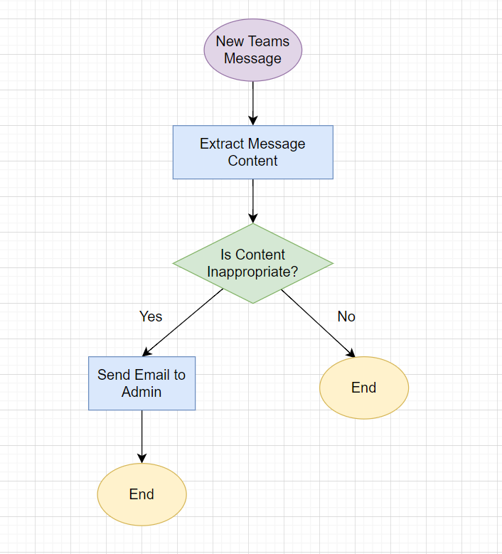
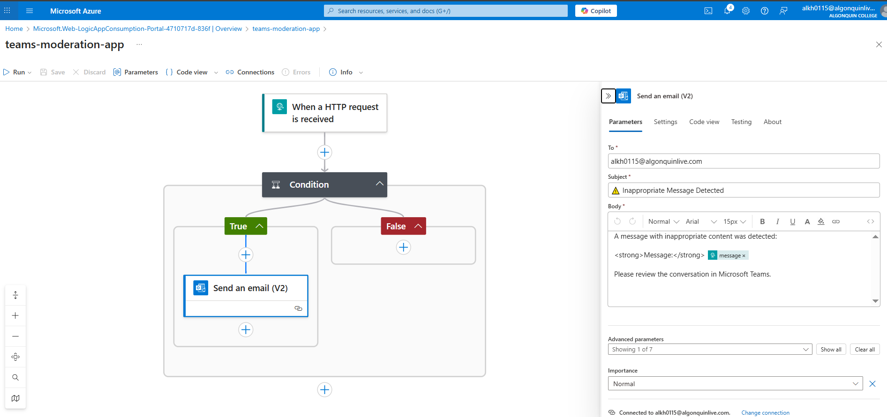
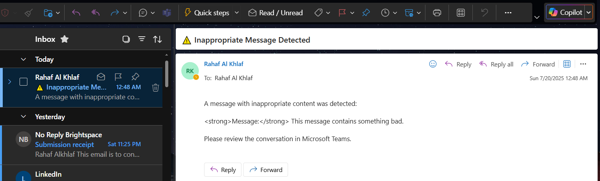

# Teams Chat Content Moderation – CST8917 Lab 3

This project implements a Microsoft Teams message content moderation service using Azure Logic Apps. The service detects inappropriate content in messages and notifies an administrator via email.

---

## Objective

Monitor Microsoft Teams messages for inappropriate language using an HTTP-based Logic App trigger and send an alert email when violations are found.

---

## Workflow Overview

- **Trigger**: HTTP request (simulating a Teams message)
- **Condition**: Check if the message contains any flagged keywords
- **True**: Send an email alert to the admin
- **False**: Do nothing

---

## Moderation Flowchart



---

## Logic App Setup

- **Trigger**: When an HTTP request is received
- **Condition**: Message contains the word `bad`
- **True Branch**:
  - Send an Outlook email to the administrator
- **False Branch**:
  - No action

### Logic App Setup – Step-by-Step

1. **Trigger: When an HTTP request is received**
   - We used this trigger to simulate receiving a message from Microsoft Teams (since direct Teams triggers require Graph API and advanced permissions).
   - The trigger accepts an HTTP POST request containing a JSON body.
   - A JSON schema was defined to expect a single property called `message`, of type `string`:
     ```json
     {
       "type": "object",
       "properties": {
         "message": {
           "type": "string"
         }
       }
     }
     ```
   - When the Logic App is saved, a public HTTP POST URL is generated. This URL was used to test the flow using `curl`.

2. **Condition: Evaluate message content**
   - A **Condition** control was added immediately after the trigger.
   - The condition checks whether the `message` field **contains** the word `"bad"`.
   - This simulates a basic content moderation policy.
   - If the condition evaluates to **true**, the workflow proceeds to the next step. Otherwise, it ends silently.

3. **If True (Yes branch): Send email alert to administrator**
   - We used the **Send an email (V2)** action from the **Office 365 Outlook** connector.
   - The Logic App was authenticated using a Microsoft 365 account (Algonquin Live).
   - The email was sent to the administrator (student’s own Algonquin email) and included:
     - A warning subject line: `⚠️ Inappropriate Message Detected`
     - A body showing the exact message content using dynamic content:
       ```html
       A message with inappropriate content was detected:<br><br>
       <strong>Message:</strong> @{triggerBody()?['message']}<br><br>
       Please review the conversation in Microsoft Teams.
       ```
   - This confirms that the violation was caught and notifies the relevant stakeholder.

4. **If False (No branch): End the workflow**
   - No action is taken when the message is clean.
   - This simplifies the flow and prevents unnecessary processing.
   - Optionally, a Compose or logging step could be added, but it was intentionally left empty for this lab.

---

## Testing

Tested the Logic App with both clean and inappropriate content via `curl`:

```bash
# Inappropriate message (triggered email)
curl -X POST "<logic_app_url>" \
  -H "Content-Type: application/json" \
  -d '{"message": "This message contains something bad."}'

# Clean message (did not trigger email)
curl -X POST "<logic_app_url>" \
  -H "Content-Type: application/json" \
  -d '{"message": "Looking forward to our meeting."}'
```
---
## Result

- Email alert successfully received for inappropriate message
- No email sent for clean message

---

## Screenshots

### 1. Logic App Designer View
Visual layout of the trigger, condition, and actions inside the Logic App.



### 2. Email Notification Received
Confirmation email sent to the admin when inappropriate content is detected.



---

## Future Enhancements

- Use **Microsoft Graph API** to listen to real Teams messages
- Add **Azure Cognitive Services for Language** (Text Moderation API)
- Preprocess message content using **Azure Functions**
- Log flagged messages to **Blob Storage or Azure Table**

---

## Demo Video

[Watch Demo on YouTube](https://youtu.be/Rdh6R9PmIzs)